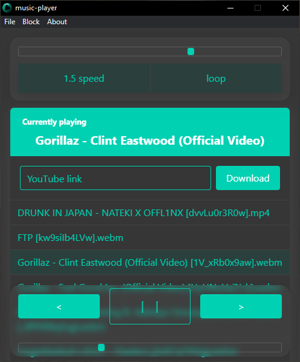

# music-player

[](https://github.com/LucasHazardous/music-player/releases/latest)

> If this software appeared on its own, you have malware on your computer. Contact a computer specialist as soon as possible.

## How to run

Use the download button to get the latest installer for your platform. If you already have any version installed, to get the newest release click the _Check for updates_ option in the file submenu.

## Controversies

I have received numerous reports of individuals randomly receving music-player software and I want to address that.
At this point its distribution got out of control with all the suspicious software websites hosting **potentially modified versions of it and possibly bundling it with other malware**. The only valid source to download this program is this Github page, where the executables are built directly by Github on its servers. 
MIT license grants anyone the freedom to do whatever they want with this software. I do not hold any responsibility for it.

## Preview

### Dark theme




### Light theme


## Usage

Press <kbd>CTRL/CMD+F</kbd> to reveal directory in which your music files will be stored. There should be also a file called [**yt-dlp.exe**](https://github.com/yt-dlp/yt-dlp) - **do not remove it**. It's also an open source project and it's responsible for downloading music from YouTube.

To get some music simply move some music files to the directory or paste a link to a music link (ex. YouTube video link, SoundCloud music link, direct link to some mp3, etc.) and click download.

-   If the music doesn't download remove yt-dlp.exe, restart the app wait for some time until its icon appears in a file explorer and try again.
-   If the music doesn't appear refresh the file list with <kbd>CTRL/CMD+R</kbd>.

To change to the dark theme press <kbd>CTRL/CMD+T</kbd>, to change back to light theme press the same keystroke. The app will automatically adjust to your current system theme.

### Upper section

Slider is for volume control, buttons can be used to change playback speed to 1.5 or to enable playing again current music when it ends.

### Bottom section

Buttons are respectively responsible for going to the previous track (goes up on the file list, skips blocked files), pausing/playing, going to the next track (goes down on the file list, also skips blocked files). Slider beneath them is responsible for changing time (double click is recommended for instant change).
To play you can also perform a click on a desired entry.

### Blocking

music-player currently does not provide any features that would allow playlist creation but what it does provide is an effective blocking system. When an entry on the list is right-clicked its text turns grey, blocked entry will not be detected in an automatic previous/next searching and will not respond to direct clicks. To unblock right-click a blocked entry. This powerful feature allows you to compose an appropriate playlist by disabling currently unwanted entries.
_Blocked_ menu section provides you the following options:

-   Unblock all - unblocks all files
-   Block all - blocks all files (this can be used when multiple entries are present and only a handful of them is going to be used)
-   Save blocked - saves currently blocked files to a file (in the same directory in which music files are stored) from which names of entries to block will be retrieved on the next window start
-   Clear saved blocked - removes the file with a list of blocked files

---

## Custom build for any system

To build clone this repository, install npm modules:

```
npm i
```

and run:

```
npm run build
```
