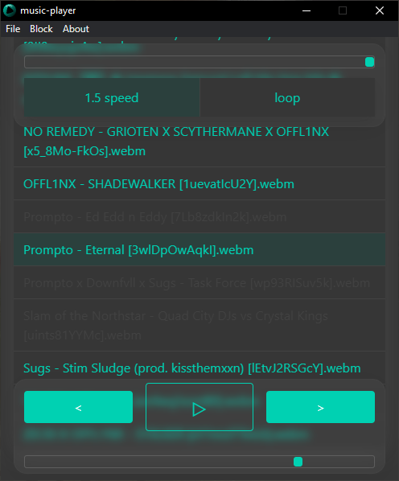
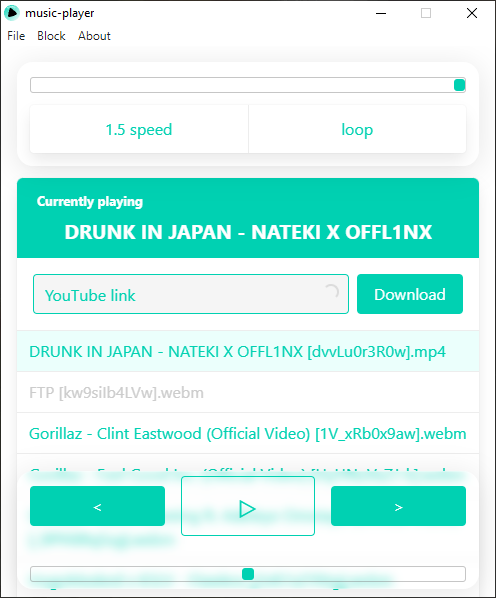
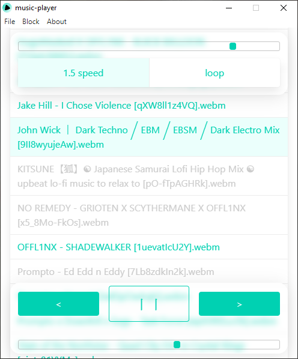

# music-player

[](https://github.com/LucasHazardous/music-player/releases/latest)

## How to run

Use the download button to get the latest installer for your platform. Installers are not signed so your system might try to stop you from installing the app but you can scan it with any antivirus program to confirm that it's safe. The installers are built directly on Github.

## Preview

### Dark theme


&nbsp;&nbsp;&nbsp;


### Light theme


&nbsp;&nbsp;&nbsp;


## Usage

All the keystrokes presented here are also available in the form of buttons in the app menu under **File**.

Press <kbd>CTRL/CMD+F</kbd> to reveal directory in which your music files will be stored. There should be also a file called [**yt-dlp.exe**](https://github.com/yt-dlp/yt-dlp) - **do not remove it**. It's also an open source project and it's responsible for downloading music from YouTube.

To get some music simply move some music files to the directory or paste a link to a YouTube music video and click download.

-   If the music doesn't download remove yt-dlp.exe, restart the app wait for some time until its icon appears in a file explorer and try again.
-   If the music doesn't appear refresh the file list with <kbd>CTRL/CMD+R</kbd>.

### Upper section

Slider is for volume control, buttons are respectively used to change playback speed to 1.5 or to enable playing again current music when it ends.

### Bottom section

Buttons are respectively responsible for going to the previous track (goes up on the file list), pausing/playing, going to the next track (goes down on the file list). Slider beneath them is responsible for changing time (double click is recommended for instant change).

To play a desired file you can also click its name on the list.

To change to the dark theme press <kbd>CTRL/CMD+T</kbd>, to change back to light theme press the same keystroke. The app will automatically adjust to your system theme.

To get the latest features and bug-fixes select **Files** button in the menu and click **Check for updates**, if there is an update, wait for it to download then restart the app.

You can quit the app with <kbd>CTRL/CMD+W</kbd>.

---

## Build

To build clone this repository, install npm modules:

```
npm i
```

and run:

```
npm run build
```
